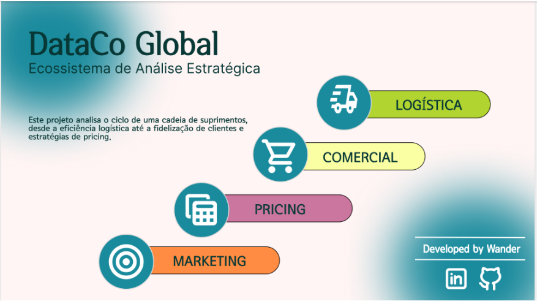
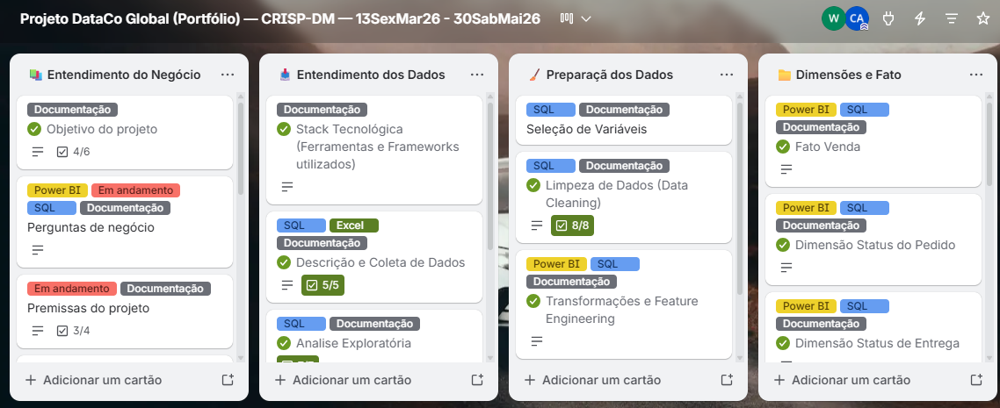
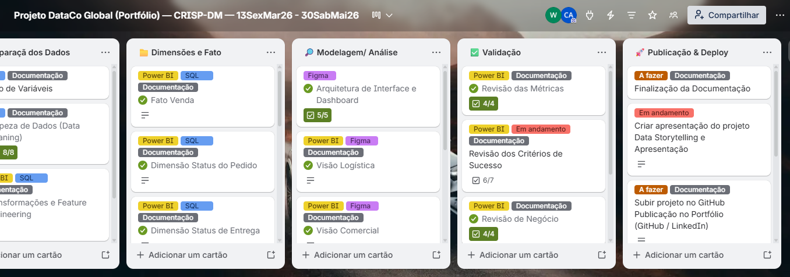
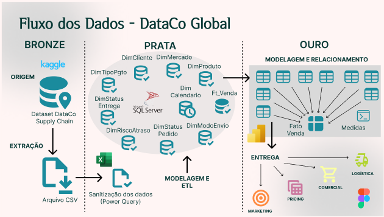

<h1 align="center"> 
DataCo Global - Ecossistema de análise estratégica
</h1>

  

## 1. O Problema de Negócio 

&nbsp;&nbsp;A <b>DataCo Global enfrentava dificuldades</b> para transformar um grande volume de transações em informações estratégicas para a tomada de decisão. Embora possuísse uma visão integrada da operação, <b>havia um desafio crítico</b>: identificar gargalos, oportunidades de crescimento e padrões de comportamento dos clientes. 

&nbsp;&nbsp;Diante desse cenário, <b>o projeto foi estruturado</b> para responder a quatro grandes desafios de negócio:

* <b>Gargalos Logísticos:</b> Mapear a cadeia de suprimentos e identificar onde os atrasos nas entregas (Lead Time) impactam a eficiência operacional e a experiência do cliente.
* <b>Eficiência Comercial:</b> Analisar a performance dos departamentos e a evolução do faturamento por mercado consumidor.
* <b>Inteligência de Pricing:</b> Avaliar a elasticidade e o impacto da política de descontos aplicada, entendendo se ela contribui para o crescimento saudável das vendas ou compromete a margem de lucro.
* <b>Retenção de Clientes:</b> Identificar padrões de comportamento de compra, taxas de churn e indicadores de fidelização, como o LTV.

## 2. Objetivo do Projeto

&nbsp;&nbsp;Este projeto tem como objetivo apresentar uma <b>solução completa de Business Intelligence</b> desenvolvida para a DataCo Global, uma grande operação de suprimentos com ampla capilaridade e atuação no mercado global.

&nbsp;&nbsp;A proposta central foi <b>integrar diferentes fluxos de dados</b> para consolidar uma <b>visão 360°</b> da operação, permitindo identificar gargalos logísticos, otimizar receitas, analisar políticas e estratégias de precificação e compreender o comportamento dos clientes em uma única plataforma analítica.

&nbsp;&nbsp;A solução foi desenvolvida integralmente sob o <b>conceito</b> de um projeto <b>End-to-End</b> (Ponta a Ponta). O ciclo abrangeu desde a gestão do <b>fluxo de trabalho</b> no Trello até o <b>tratamento e a modelagem</b> dos dados em SQL Server e Excel, o <b>protótipo e design de interface</b> (UI/UX) no Figma, a construção do <b>dashboard interativo</b> no Power BI e a <b>documentação técnica</b> publicada no GitHub.

## 3. Gestão e Metodologia

&nbsp;&nbsp;Para garantir organização, governança e rastreabilidade ao projeto, utilizei o Trello como ferramenta central de gerenciamento das atividades. A <b>estrutura do trabalho</b> foi baseada na <b>metodologia CRISP-DM (Cross Industry Standard Process for Data Mining)</b>, adaptada para um fluxo de desenvolvimento ágil com o framework <b>Kanban</b>.

* <b>Organização por Etiquetas:</b> As tarefas foram segmentadas por status (A Fazer, Em Andamento, Impedimento e Concluído), tecnologias utilizadas (SQL, Power BI, Excel e Figma) e documentação, permitindo acompanhar de forma clara a evolução técnica de cada etapa do projeto.
* <b>Rastreabilidade e Qualidade:</b> O uso de checklists, prazos e validações garantiu maior controle sobre todas as fases do desenvolvimento, desde o entendimento do negócio até a publicação final do dashboard.

  

  

## 4. Stack Tecnológica (Ferramentas e Frameworks) 

* <b>Gestão e Processo:</b> Trello (Framework Kanban e metodologia CRISP-DM).
* <b>Engenharia de Dados e ETL:</b> SQL Server (T-SQL) e Excel/Power Query.
* <b>Interface e UI/UX:</b> Figma (design e prototipação).
* <b>Analytics e Visualização:</b> Power BI (modelagem dimensional Star Schema e expressões DAX).
* <b>Documentação e Apoio Analítico:</b> IA Generativa, adotada estrategicamente no refinamento da documentação e na validação da consistência lógica dos indicadores.

## 5. Arquitetura da Solução e Pipeline de Dados 

&nbsp;&nbsp;O projeto foi <b>estruturado</b> seguindo as boas práticas da <b>Arquitetura Medalhão</b>, organizando o fluxo dos dados em três camadas: <b>Bronze</b> (Raw/Dados Brutos), <b>Prata</b> (Silver/Dados Tratados) e <b>Ouro</b> (Gold/Dados Refinados e Prontos para o Negócio). Essa abordagem <b>permitiu separar as etapas</b> de ingestão, transformação e análise, garantindo maior organização, rastreabilidade e qualidade dos dados ao longo de todo o processo analítico.

  

### Macrofluxo do Ciclo de Vida do Dado:

1. <b>Ingestão:</b> Extração do dataset DataCo Supply Chain disponibilizado no Kaggle.
2. <b>Tratamento (ETL):</b> Sanitização inicial no Power Query via Excel e padronização dos dados no SQL Server, com foco em tipagem, tratamento de nulos, duplicidades e consistência das informações.
3. <b>Modelagem:</b> Implementação de um modelo dimensional (Star Schema) no Power BI para otimizar a performance analítica e a escalabilidade das métricas.
4. <b>Design:</b> Desenvolvimento de uma interface personalizada no Figma, com foco em experiência do usuário (UX) e navegação analítica.
5. <b>Entrega:</b> Publicação de um dashboard interativo contendo quatro visões integradas de negócio: Logística, Comercial, Pricing e Marketing.

## 6. Índice de Navegação

&nbsp;&nbsp;Consulte os bastidores detalhados de cada <b>etapa técnica e de negócio</b> através dos <b>submódulos</b> abaixo: 

  📘 <a href="#">Engenharia de Dados e Modelagem</a>  Disponível em 09/06/2026
  🚚 <a href="#">Visão Logística</a>  Disponível em 16/06/2026
  💰 <a href="#">Visão Comercial</a>  Disponível em 23/06/2026
  📊 <a href="#">Visão Pricing</a>  Disponível em 30/06/2026
  🎯 <a href="#">Visão Marketing</a> Disponível em 07/07/2026

